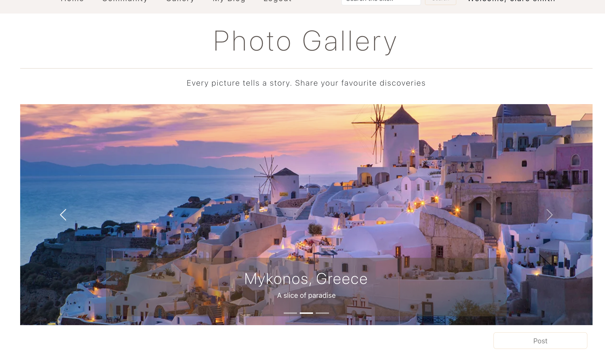
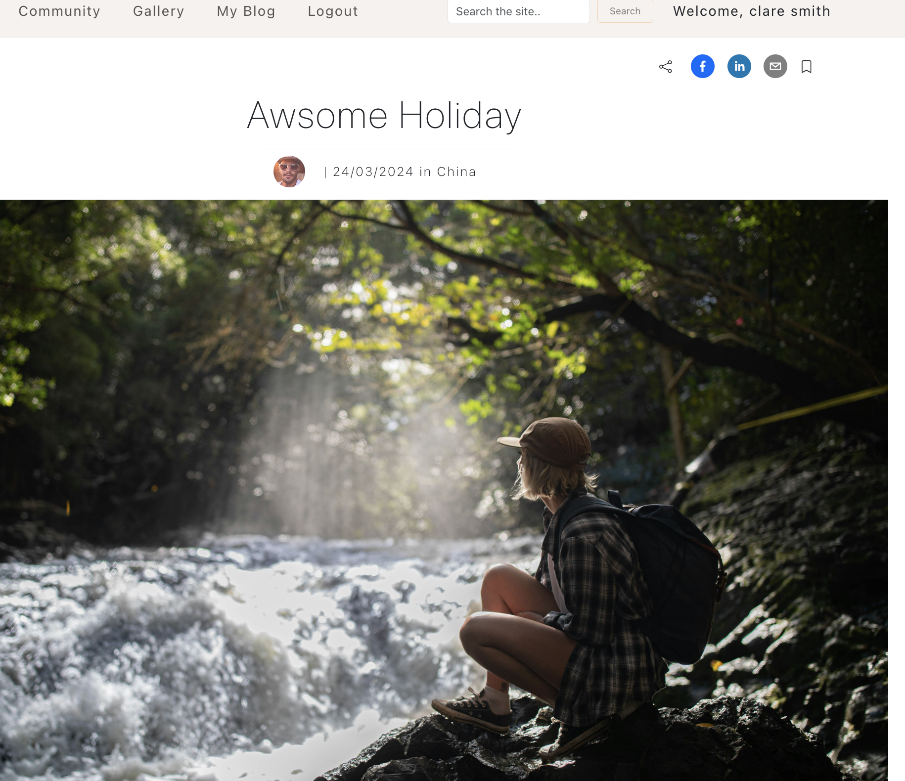

# Travel Blog by James, Mahshid, Jordan & Hayley

## About
As a group of four people who love travelling and taking photos, we built a social media app that is focused on Travelling. 

Users can upload a post (which consists a photo, country, title and context) after loggin in and the comment section lets users to communicate with each other. 

Gallery page is purely focused on posting photos, so if you want to see all the fascinating photos taken around the world, head to the Gallery page.

In My Blog page, you can manage your profile photo, bio, map and posts that you uploaded.

## Heroku deployment

To view the website, click this link: [Travel Wikkimedia](https://travel-wikkimedia-e201bd728fb6.herokuapp.com)

## Images

    
    

## Languages/ Technologies used

* CSS - Bootstrap
* JavaScript - Node.js
* Express.js
* React.js
* MongoDB & Mongoose
* Heroku
* APIs - Map, Restcountries

## UX / UI

We used Bootstrap and some custom CSS to make the website as professional as possible. Simple yet efficient and clean look has been achieved.

## Next Steps

* Improvements on share buttons in the blog detail page
* Save (Favourite) feature
* Search feature
* Public and private feature for posts